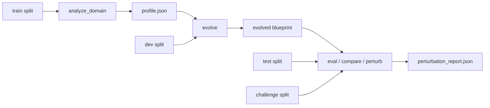

# stem-agent

stem-agent is a minimal agent that specializes itself for a class of
problems through measurable evolution. The chosen problem class is
single-function Python bug repair on a 40-task benchmark.

On the held-out test split (n=12), the deployed evolved blueprint
solves 12/12 with 37 actual attempts; the unmodified stem solves 9/12
with 47. The deployed strategy is reverse-alphabetical primitive
priority at budget 12, attributed to variant-fanout dynamics on this
synthetic benchmark.

This submission attempted a learned specialization mechanism; ablation rejected it, and the surviving result is budget plus ordering.

## Test-split results

Numbers below come from `docs/evaluation/perturbation_report.json`,
the load-bearing ablation report regenerable from the documented
pipeline.

| row                  | pass rate     | Wilson 95% CI    | actual | mean iters / solved |
|---|---|---|---|---|
| stem default         | 9/12 (75.0%)  | [46.8, 91.1]     | 47     | 2.56                |
| stem evolved budget  | 11/12 (91.7%) | [64.6, 98.5]     | 55     | 3.91                |
| deployed evolved     | 12/12 (100%)  | [75.8, 100.0]    | 37     | 3.08                |
| reverse only         | 12/12 (100%)  | [75.8, 100.0]    | 37     | 3.08                |
| policy only          | 12/12 (100%)  | [75.8, 100.0]    | 42     | 3.50                |
| zero policy          | 12/12 (100%)  | [75.8, 100.0]    | 37     | 3.08                |
| random policy        | 11/12 (91.7%) | [64.6, 98.5]     | 51     | 3.55                |

Deployed evolved is identical to reverse only at budget 12 (rows 3
and 4 are the same strategy by construction). The Wilson 95%
intervals overlap across all four 12/12 rows; on n=12 this is a
suggestive single-run result, so n=12 is the binding constraint on
the pass-rate claim.

The full discussion (blueprint diff, rejected-policy reasoning,
challenge-split boundary analysis) is in `docs/writeup.md`.

## Pipeline



The pipeline is fully deterministic and runs without network access.
There is no LLM in the system.

## Quickstart

Three commands reproduce the headline from a clean checkout
(Python >= 3.9):

```bash
# 1. install
pip install -e .

# 2. run the offline test suite (104 tests)
PYTEST_DISABLE_PLUGIN_AUTOLOAD=1 python -m pytest tests/

# 3. regenerate the canonical perturbation report
python -m stem_agent.cli evolve --bench benchmarks/pybugs --out artifacts
python -m stem_agent.cli perturb \
    --stem artifacts/stem_blueprint.json \
    --evolved artifacts/evolved_blueprint.json \
    --bench benchmarks/pybugs --splits test challenge --seed 1234 \
    --out docs/evaluation/perturbation_report.json
```

Step 3 must reproduce the committed report byte-for-byte;
`tests/test_perturb.py::test_canonical_perturbation_report_is_regenerable`
enforces that.

## Benchmark splits

40 tasks under `benchmarks/pybugs/`, four splits:

- `train/` (12 tasks): used by `analyze_domain` to estimate primitive
  priors and the recommended budget.
- `dev/` (8 tasks): used by generational evolution to score candidate
  blueprints. The dev winner is selected by maximum pass rate then
  minimum total actual attempts.
- `test/` (12 tasks): held out; never opened during analysis or
  evolution. The headline pass-rate numbers come from this split.
- `challenge/` (8 tasks): bugs whose repair is not a single-site
  application of any primitive. Both the stem and the deployed
  evolved blueprint fail every challenge task; reported separately as
  boundary analysis, with `actual` and `eff_bud` attempts side by
  side.

The eight in-bank and eight challenge bug families are listed in
`benchmarks/pybugs/README.md`.

## Full pipeline

The Quickstart's evolve plus perturb is enough to reproduce the
committed report. The grouped commands below regenerate every
artifact under `artifacts/` as well.

**(a) Evolve and produce blueprints.** Domain probe over train, then
generational evolution over dev. Writes the stem and evolved
blueprints, the domain profile, and the evolution log.

```bash
python -m stem_agent.cli evolve --bench benchmarks/pybugs --out artifacts
```

**(b) Evaluate each blueprint on the held-out test split.**

```bash
python -m stem_agent.cli eval \
    --blueprint artifacts/stem_blueprint.json \
    --bench benchmarks/pybugs --split test --out artifacts/stem_test.json

python -m stem_agent.cli eval \
    --blueprint artifacts/evolved_blueprint.json \
    --bench benchmarks/pybugs --split test --out artifacts/evolved_test.json
```

**(c) Budget-controlled four-row stem-vs-evolved on test and
challenge.**

```bash
python -m stem_agent.cli compare \
    --stem artifacts/stem_blueprint.json \
    --evolved artifacts/evolved_blueprint.json \
    --bench benchmarks/pybugs --split test \
    --out artifacts/compare_test.json

python -m stem_agent.cli compare \
    --stem artifacts/stem_blueprint.json \
    --evolved artifacts/evolved_blueprint.json \
    --bench benchmarks/pybugs --split challenge \
    --out artifacts/compare_challenge.json
```

**(d) Canonical perturbation report (test + challenge in one JSON).**

```bash
python -m stem_agent.cli perturb \
    --stem artifacts/stem_blueprint.json \
    --evolved artifacts/evolved_blueprint.json \
    --bench benchmarks/pybugs --splits test challenge --seed 1234 \
    --out docs/evaluation/perturbation_report.json
```

The pipeline is deterministic; two consecutive `evolve` runs produce
a byte-identical `evolved_blueprint.json`, and two consecutive
`perturb` runs produce a byte-identical report (pinned by
`tests/test_pipeline.py` and `tests/test_perturb.py`).

(optional) solve a single task with a chosen blueprint:

```bash
python -m stem_agent.cli solve \
    --blueprint artifacts/evolved_blueprint.json \
    --task benchmarks/pybugs/test/task_021
```

## Layout

```
stem_agent/      core package (blueprint, primitives, runner, agent, evolve, perturb, policy, stats, cli)
benchmarks/      pybugs benchmark, 40 tasks across train/dev/test/challenge splits
tests/           offline tests (no network, no API keys required)
artifacts/       blueprints, evaluation outputs, comparison tables (regenerable; not committed)
docs/writeup.md  the write-up reviewers should read first
docs/evaluation/perturbation_report.json  committed ablation report
```

## Artifacts under `artifacts/`

These are produced by the documented pipeline run, not committed:

- `profile.json`: the `DomainProfile` from train probing.
- `stem_blueprint.json`: domain-agnostic baseline blueprint.
- `evolved_blueprint.json`: the deployed evolved blueprint, carrying
  the dev-winning priority and budget. No policy fields.
- `evolution_log.json`: per-generation, per-candidate scoring trace
  with full blueprint, parent name, mutation reason, per-task
  records on each candidate, and the stop condition on the final
  entry.
- `stem_test.json`, `evolved_test.json`: per-task evaluation on the
  held-out test split, with Wilson 95% CIs on the pass rate and
  actual / effective-budget attempt sums.
- `compare_test.json`, `compare_challenge.json`: four-row
  budget-controlled stem-vs-evolved tables on the in-bank test split
  and the challenge split.

## Troubleshooting

`PYTEST_DISABLE_PLUGIN_AUTOLOAD=1` is recommended because some
Anaconda or user-site Python installs ship third-party pytest
plugins whose plugin-load step writes assertion-rewrite caches and
can hang for a minute or more on a fresh environment. This project
depends on no third-party pytest plugins, so disabling autoload is
safe and keeps the documented invocation robust.
